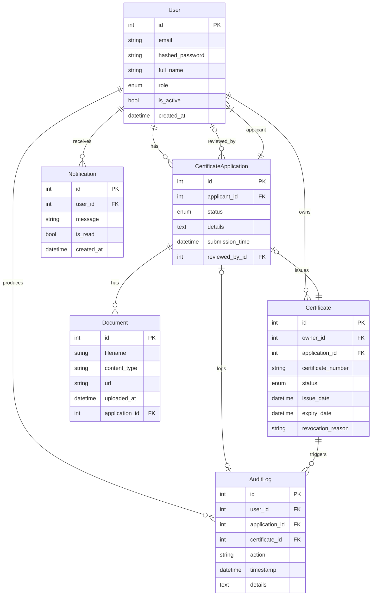

# E-Police Certificate (EPCC) Suite: Deployment, Delivery & Handoff Documentation

---

## Table of Contents

1. [Overview](#overview)
2. [Deployment Instructions](#deployment-instructions)
   - [Backend Deployment](#backend-deployment)
   - [Frontend Deployment](#frontend-deployment)
3. [REST API Reference](#rest-api-reference)
4. [Database Schema & Relationships](#database-schema--relationships)
5. [Admin and End-User Workflow Guides](#admin-and-end-user-workflow-guides)
6. [Localization (Multi-language Support)](#localization-multi-language-support)
7. [Security & Configuration Considerations](#security--configuration-considerations)
8. [Handoff & Maintainability Checklist](#handoff--maintainability-checklist)
9. [Appendix: Diagrams](#appendix-diagrams)

---

## Overview

The EPCC Suite is a full-stack application for managing E-Police Certificate operations. Its backend is built using FastAPI (Python), utilizing SQLite with SQLAlchemy ORM for persistence, and exposes RESTful APIs for user, certificate, and admin workflows. The frontend is a React application allowing users and admins to interact via an intuitive, localized web interface. The suite offers user registration/authentication, certificate application/review, document upload, notification, and audit log features.

---

## Deployment Instructions

### Backend Deployment (`epcc_backend`)

#### Prerequisites

- Python 3.9+ is recommended.
- [pip](https://pip.pypa.io/en/stable/installation/) (Python package installer)

#### Installation & Running

1. **Clone the repository** (if not yet cloned):

    ```bash
    git clone <REPO_URL>
    cd e-policecert-suite-118001-118010/epcc_backend
    ```

2. **Install dependencies:**

    ```bash
    pip install -r requirements.txt
    ```

3. **Environment Variables (optional):**

    - `EPCC_DATABASE_URL` (default: `sqlite:///./epcc.sqlite3`)
    - `EPCC_SECRET_KEY` (default: `"devsecret"`)

    Set environment variables as needed for production, e.g.:
    ```bash
    export EPCC_SECRET_KEY='your-very-secure-secret'
    export EPCC_DATABASE_URL='sqlite:///./prod-epcc.sqlite3'
    ```

4. **Database Initialization:**

    No manual steps required! On first launch, the backend will auto-create the database schema.

5. **Run the Backend (Dev):**

    ```bash
    uvicorn src.api.main:app --reload --port 3001
    ```
   This exposes the API at [http://localhost:3001](http://localhost:3001), with documentation at `/docs`.

6. **Uploads Directory:**
   
    Uploaded files will be saved in `uploads/` in the backend directory.

#### Notes for Production

- For production, use process managers (e.g. gunicorn with Uvicorn workers) and HTTPS.
- Ensure secure storage of `EPCC_SECRET_KEY` and use a robust DB solution for scaling.

---

### Frontend Deployment (`epcc_frontend`)

#### Prerequisites

- Node.js (v16 or later recommended)
- npm (comes with Node.js)

#### Installation & Running

1. **Navigate to the frontend:**
    ```bash
    cd e-policecert-suite-118001-118011/epcc_frontend
    ```

2. **Install dependencies:**
    ```bash
    npm install
    ```

3. **Configure Backend URL:**
    - Create or update `.env` file in the frontend root:
      ```
      REACT_APP_EPCC_BACKEND_URL=http://localhost:3001
      ```
      Adjust for production deployment server as needed.

4. **Start the Frontend:**
    ```bash
    npm start
    ```
   Accessible locally at [http://localhost:3000](http://localhost:3000).

5. **Build for Production:**
    ```bash
    npm run build
    ```

#### Integration

- Ensure both backend (`localhost:3001`) and frontend (`localhost:3000`) are running.
- The frontend proxies API requests using the URL from `REACT_APP_EPCC_BACKEND_URL`.

---

## REST API Reference

The backend exposes OpenAPI/Swagger docs at `/docs` (e.g. [http://localhost:3001/docs](http://localhost:3001/docs)).

### Key Endpoints

#### Auth & User
- `POST /register` — Register a new user
- `POST /token` — Login to get JWT
- `GET /me` — Get current user profile

#### Certificate Application & Management
- `GET /applications` — List user’s applications
- `POST /applications` — Submit a new application
- `GET /applications/{application_id}` — Get application by ID

#### Certificate Operations
- `GET /certificates` — List owned certificates
- `GET /certificates/{certificate_id}` — View specific certificate

#### Document Upload/Download
- `POST /documents/upload` — Upload document (requires application ID and file)
- `GET /documents/download/{filename}` — Download file
- `GET /applications/{application_id}/documents` — List application’s docs

#### Notifications
- `GET /notifications` — List user notifications
- `PATCH /notifications/{notification_id}/markread` — Mark notification as read

#### Admin/Officer Endpoints
- `GET /admin/applications` — List all certificate applications
- `PATCH /admin/applications/{application_id}` — Change application status
- `POST /admin/applications/{application_id}/certificates` — Issue certificate
- `PATCH /admin/certificates/{certificate_id}/revoke` — Revoke certificate
- `GET /admin/auditlogs` — Audit logs (latest 100)

**All state-changing endpoints require authenticated JWT (Bearer token). Admin/Officer endpoints require elevated roles.**

---

## Database Schema & Relationships

### ER Diagram (Mermaid Syntax)



#### Notes

- All dates are in UTC.
- Cascade rules are typically ON DELETE SET NULL/RESTRICT for FK.
- Enum fields: `UserRole` (user, admin, officer), `CertificateStatus` (pending, approved, rejected, issued, revoked).

---

## Admin and End-User Workflow Guides

### For End Users

1. **Register an Account**
   - Go to the registration page and submit your details.
2. **Login**
   - Use your credentials to log in and access dashboard.
3. **Apply for Certificate**
   - Navigate to the Application form, fill details, attach documents.
   - Submit; application moves to ‘pending’ status.
4. **View Applications/Certificates**
   - Track application status via dashboard.
   - Download/view issued certificates.
5. **Upload/Download Documents**
   - Attach supporting files to applications; download files as needed.
6. **Notifications**
   - Receive status updates; notifications shown in-app.

### For Admins/Officers

1. **Login with Officer/Admin Credentials**
   - Use assigned credentials or switch user role as needed.
2. **Review Applications**
   - Access all applications; view supporting documents.
   - Approve, reject, or leave comments.
3. **Issue or Revoke Certificates**
   - Approve/issue certificates after review.
   - Specify expiration or revocation reasons.
4. **Manage Users**
   - View user list, audit their actions.
5. **Access Audit Logs**
   - Track history of critical operations.

---

## Localization (Multi-language Support)

### Backend (`epcc_backend`)

- Returns user-facing status/error messages in English, French, or Arabic.
- Supported via `accept-language` header on requests.
- Key status messages (e.g., registration/login/certificate events) are translated.

### Frontend (`epcc_frontend`)

- Uses a translation context with dictionaries (e.g., English, Bislama).
- Switch language via UI in the navbar.
- Strings for major components (dashboard, auth, application/notification flows) are localized.
- Add more strings or languages in `src/i18n.js` file.

---

## Security & Configuration Considerations

- **JWT Authentication** for all sensitive routes. Tokens expire after 48h by default.
- **Role-based Access Control** for admin/officer actions.
- **Environment Variables**: Do _not_ expose the secret key or DB creds in the codebase.
- **CORS** is enabled for all origins (in development)—restrict as needed for production security.
- Always use HTTPS in production.
- Uploaded files are written to the `uploads/` directory—review file permissions and exposure.

---

## Handoff & Maintainability Checklist

- [ ] All code committed, pushed to repository, with essential comments.
- [ ] `requirements.txt` & Node dependencies are up-to-date.
- [ ] Documentation (this file) is current and covers deployment, APIs, schema, localization, and security config.
- [ ] Example `.env` files for both frontend and backend are provided.
- [ ] All major API/user/admin workflows tested (registration, login, certificate apply/issue, document upload, notification).
- [ ] OpenAPI spec is accessible at `/docs` on the backend.
- [ ] Admin credentials are handed over securely (passwords not in version control).
- [ ] All state-changing operations (approval/issue/revoke) tested with different roles.
- [ ] Database backup and migration procedures documented if using non-SQLite.

---

## Appendix: Diagrams

### Component & Integration Flow

```mermaid
flowchart TD
    FE[User/Officer/Admin via Browser]
    Frontend[React App (epcc_frontend)]
    Backend[FastAPI Backend (epcc_backend)]
    SQLite[(SQLite DB)]
    FE-->|HTTP/HTTPS (REST, JWT)|Frontend
    Frontend-->|API requests|Backend
    Backend-->|ORM|SQLite
    Backend-->|File ops|UploadsDir[uploads/]
```

---

## Sources

- Backend: `epcc_backend/src/api/main.py`, `epcc_backend/src/api/db.py`
- Frontend: `epcc_frontend/src/`
